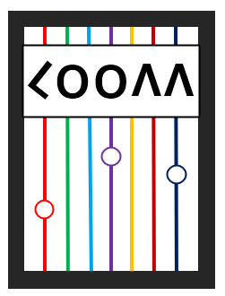

<p align="center">
  
</p>

# Loom

**Loom** is a visual esoteric programming language that operates on a 32×32 memory grid. Inspired by Brainf**k, Loom weaves colorful patterns directly into a screen-grid using a minimal, expressive syntax. Each memory cell stores a value between `0` and `31`, corresponding to a 32-color palette.

Unlike traditional esolangs, Loom **unifies code, memory, and screen into one fabric**, literally. Movement, arithmetic, randomness, and drawing are achieved through compact, symbolic commands that produce intricate visual results.

---

## 🧵 Language Features

- 32×32 **wraparound grid** shared by screen and memory
- **Drawing via memory**: `x` draws a pixel at current location using `(value % 32)` as color
- Fully navigable: use `<`, `>`, `^`, `v` for movement
- Supports repeat counts (e.g., `>23` = move right 23 steps)
- Built-in support for **randomness** and **loops**
- Clean syntax: comments allowed using unquoted text; reserved symbols (`>`, `<`, etc.) must be quoted inside comments

---

## ✨ Operators

| Symbol   | Description                                                                 |
|----------|-----------------------------------------------------------------------------|
| `>`      | Move cursor **right** go back to first cell if screen size exceeded         |
| `<`      | Move cursor **left**  go to the end of  the line if less than zero          |
| `^`      | Move cursor **up**    go to the end of the column if less than zero         |
| `v`      | Move cursor **down**  go back to the top if screen size exceeded            |
| `+`      | Increment current cell (wraps at 32)                                        |
| `-`      | Decrement current cell (wraps at 0)                                         |
| `o`      | return back to the original cell grid[0, 0]                                 |
| `x`      | display the content of the current cell to the screen                       |
| `*`      | for debugging display usful information for the current cell                |
| `?`      | Set current cell to a **random** number from 0–32                           |
| `{}` `[]` `()` | **Loop**: repeat enclosed code block while cell ≠ 0                   |
| `'`...`'` | Quoted strings — used in comments or to escape special symbols             |

**Repeat counts**: Any movement or arithmetic operator can be followed by a number (e.g., `+12`, `>5`) for efficiency.

---

## 🧪 Example Program

The following program generates a **radial rainbow explosion** from the center outward using color logic, movement, and nested loops:


```loom
+{?x.+31[>?x.<[>+<-]>-]v>+}
```

### Explanation

- `+{}`: Start the outer loop to draw multiple random lines
- `?x`: Set current cell to a random value and display it on the screen `x`  
- `+31[...]`: Add 31 and begin inner loop for the number of cells at each line 
- `[>?x.<[>+<-]>-]`: Use nested loops to draw random cells for each line 
- `v>+`: Move to the next line start from the beginning

### 🖼️ Output Visualization

<p align="center">
  
</p>

---

## 🧰 Usage

### Compile

```bash
javac src/App.java
```

### Run

```bash
java -cp src App "+{?x.+31[>?x.<[>+<-]>-]v>+}"
```

---

## 📁 Project Structure

```
loom/
├── src/
│   ├── Loom.java
│   └── App.java
├── resources/
│   ├── loom.png
│   └── icon.png
│   └── ex1.png
├── examples/
│   └── rand.lm
├── README.md
└── .gitignore
```

---

## 📜 License

MIT License © 2025 Your Name